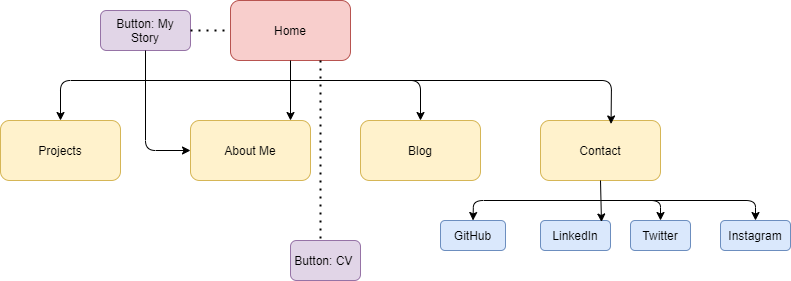

General project documentation is to be compiled as a single markdown file named README.md. This file should contain,

A link (URL) to your published portfolio website
A link to your GitHub repo
Description of your portfolio website, including,
Purpose
Functionality / features
Sitemap
Screenshots
Target audience
Tech stack (e.g. html, css, deployment platform, etc)

Portfolio Website Assessment | T1A2
<!-- Link to deployed/published site-->
https://github.com/TheMurcian/portfolio

https://dylanestebanportfolio.netlify.app/

Purpose: this website was built to provide application of working knowledge of HTML and CSS. Moreover, it was designed to create an online presence for myself as a future developer, as well as produce a repository and illustration for future projects to demonstrate my passions, interests, and most improtantly, my work and skills. 

Screen Shots:

Functionality: 
- This site includes a landing page, about-me page, a blog, as well as a page for contact
- Balsamiq was employed to design and implement wireframes.
- A responsive home page with a few transition effects and animations which immediately seek to introduce the viewer to my site as well as an indication of my identity, passions, and aspirations 
- An integrated Nav Bar that is responsive and accessible across all of the site's pages, linking to their appropriate locations within the various pages/html files.
- A responsive footer which home's several links to my professional and social media platforms and pages, and also is accessible at the bottom of each page.  
- Buttons which serve as immediate links to access and download my CV found on both the Home and About Me pages.
- The About Me page which serves as an introduction to my work, background, passions, and skills. 
- The dedicated projects page which will serve as a repository to show-case future projects.
- The with links to professional and social media platforms as well as an email form.
- Comments have been added where appropriate in both the HTML and CSS to aid readability.
- Care was taken to ensure a responsive web experience for mobile, table, and desktop users. There were some difficulties encountered when designing specifically for mobile. These defects will be addressed in future, and I hope to learn from my mistakes as I continue to develop.
Accessibility considerations have been made, though improvement can be made on this area in future. 

Target Audience: my teachers, potential employers, recruiters, and myself. This piece represents my first project and attempt to produce a meaningful online presence. It is a modest effort that I will return to in order to add and build upon, but I hope one day to look back on with pride to see how far I have come. It is as much of an site to garner an online presence as it was a means of demonstrating to myself that with patience, time, hard work, and also passion, you can achieve great things. The possibilities beyond this point are endless. 

Tech stack:
- HTML
- CSS
- Netlify
